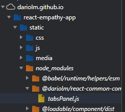

Se ha usado [Create React App](https://github.com/facebook/create-react-app) como boilerplate.

El objetivo es hacer uso de la librería [react-common-components-library](https://github.com/DarioLM/react-common-components-library) de forma óptima. En primer lugar, haciendo uso de imports dinámicos para solo traer de la librería los chunks deseados, y en segunda instancia, cargar a petición los modulos que no estén visualizándose en pantalla.

## LIVE VERSION

Desplegado en este mismo repositorio en GitHub Pages: https://dariolm.github.io/react-empathy-app/

Chunks cargados en carga de la página:

  

## StoryBook

Los componentes usados de la libreria [react-common-components-library](https://github.com/DarioLM/react-common-components-library) se pueden consultar en el [Storybook](https://dariolm.github.io/react-common-components-library/)

## Engines

De forma local se han usado las siguientes versiones:
- **NodeJS**: 10.16.3
- **Yarn**: 1.17.3
- **Npm**: 6.9.0

## Getting started

### `npm install`

Se instalarán las dependencias necesarias incluyendo la librería requerida en esta tarea [react-common-components-library](https://github.com/DarioLM/react-common-components-library).

### `yarn start / npm run-script start`

Arranca la aplicación en modo desarrollo. 
Se accede en [http://localhost:3000](http://localhost:3000).

## Datos importantes

Toda la lógica princial se encuentra en el fichero **/components/HomePage.jsx** .
Se hace uso de [loadable](https://reactrouter.com/web/guides/code-splitting) para la carga de componente a petición (en el momento de visualizarlo en pantalla).

La librería dónde se han implementado los componentes para este caso de prueba se puede consultar en:
[react-common-components-library](https://github.com/DarioLM/react-common-components-library)

Se ha establecido el registry a **https://npm.pkg.github.com/dariolm** para instalar la librería alojada en GitHub.
Las diferentes versiones de dicha librería se pueden consultar en [react-common-components-library](https://github.com/DarioLM/react-common-components-library/packages/395772)